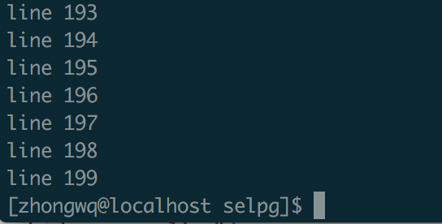

# Golang版本的 Selpg

[TOC]

### 使用简介

```bash
USAGE: ./selpg --s start_page --e end_page [ --f | --l lines_per_page ] [ --d dest ] [ in_filename ]
```

### 关于Selpg的说明
[开发Linux 命令行实用程序中的selpg](https://www.ibm.com/developerworks/cn/linux/shell/clutil/index.html)
[Selpg的C语言版本](https://www.ibm.com/developerworks/cn/linux/shell/clutil/selpg.c)

### 开发过程
#### 程序总体设计
在看完上面[开发Linux 命令行实用程序中的selpg](https://www.ibm.com/developerworks/cn/linux/shell/clutil/index.html)的内容以及分析完[Selpg的C语言版本](https://www.ibm.com/developerworks/cn/linux/shell/clutil/selpg.c)后，我发现命令行程序的开发主要有以下几个部分:

* 读取命令行输入的指令
* 解析命令，将其中的参数结构化并检验是否合法
* 实现命令对应的操作
* 输入命令不合法或者操作出错时的提示

#### 读取命令行输入的指令并解析，将其中的参数结构化
在go的开发中，我把读取指令及解析参数放到了一个部分，因为在golang中，提供了强大的flag(Pflag)库，我们很轻松就可以使用它完成指令的读取以及解析如下:

```go
sa := new(selpg_args)
// Get args by flag(Pflag)
flag.IntVar(&sa.start_page, "s", -1, "The start page")
flag.IntVar(&sa.end_page, "e", -1, "The end page")
flag.IntVar(&sa.page_len, "l", -1, "The length of the page")
flag.StringVar(&sa.print_dest, "d", "", "The destination to print")

f_flag := flag.Bool("f", false, "")
flag.Parse()

if *f_flag {
	sa.page_type = false
	sa.page_len = -1
} else {
	sa.page_type = true // page_type default True
}

sa.in_filename = ""

if flag.NArg() == 1 {
	sa.in_filename = flag.Arg(0)
}
```

由于题目要求，我们使用的是Pflag, 在导入的时候，直接 import flag    "github.com/spf13/pflag"即可，通过该库，这一步很快就得以完成指令的读取与解析

#### 检验参数是否合法
这一步主要是检验参数是否过多, start_page和end_page是否输入且输入是否合法以及--l和--f是否冲突，因为我们的start_page和end_page初始为-1，检验是否小于等于0不仅能检验是否合法，还能检验是否输入了start_page和end_page

```go
func validate_args(sa selpg_args, rest int) { // 检验输入参数是否合法，rest为剩余的参数数目
	if rest > 1 {
		fmt.Fprintf(os.Stderr, "./selpg: too much arguments\n")
		usage()
		os.Exit(1)
	}
	if sa.start_page <= 0 || sa.end_page <= 0 || sa.end_page < sa.start_page {
		fmt.Fprintf(os.Stderr, "./selpg: Invalid start, end page or line number")
		usage()
		os.Exit(1)
	}
	if sa.page_type == false && sa.page_len != -1 {
		fmt.Fprintf(os.Stderr, "./selpg: Conflict flags: -f and -l")
		usage()
		os.Exit(1)
	}
}
```

#### 实现命令对应的操作
按照c语言版本的程序，我们对应加上需要使用的参数

```go
// initial
fin := os.Stdin
fout := os.Stdout
line_ctr := 0 /* line counter */
page_ctr := 1 /* page counter */
var inpipe io.WriteCloser
var err error // store err msg
```

判断有无输入文件，即判断是键盘输入还是文件输入

```go
if sa.in_filename != "" {
	fin, err = os.Open(sa.in_filename)
	if err != nil {
		fmt.Fprintf(os.Stderr, "./selpg: could not open input file \"%s\"\n", sa.in_filename)
		usage()
		os.Exit(1)
	}
	defer fin.Close()        // 函数返回前执行fin.Close()
}
```

判断输出方式

```go
if sa.print_dest != "" {
	cmd := exec.Command("lp", "-d", sa.print_dest)
	inpipe, err = cmd.StdinPipe()
	if err != nil {
		fmt.Fprintf(os.Stderr, "could not open pipe to \"%s\"\n", sa.print_dest)
		usage()
		os.Exit(1)
	}
	defer inpipe.Close()
	cmd.Stdout= fout
	cmd.Start()
}
```

根据分页方式进行读入

```go
if sa.page_type == true {
	line := bufio.NewScanner(fin)
	for line.Scan() {
		if page_ctr >= sa.start_page && page_ctr <= sa.end_page  {
			fout.Write([]byte(line.Text() + "\n"))
			if sa.print_dest != "" {
				inpipe.Write([]byte(line.Text() + "\n"))
			}
		}
		line_ctr++
		if line_ctr == sa.page_len {
			page_ctr++
			line_ctr = 0
		}
	}
} else {
	reader := bufio.NewReader(fin)
	for {
		pageContent, err := reader.ReadString('\f')
		if err != nil || err == io.EOF {
			if err == io.EOF {
				if page_ctr >= sa.start_page && page_ctr <= sa.end_page {
					fmt.Fprintf(fout, "%s", pageContent)
				}
			}
		}
		break
		pageContent = strings.Replace(pageContent, "\f", "", -1)
		page_ctr++
		if page_ctr >= sa.start_page && page_ctr <= sa.end_page {
			fmt.Fprintf(fout, "%s", pageContent)
		}
	}
}
```

判断页数是否有误

```go
if page_ctr < sa.start_page {
	fmt.Fprintf(os.Stderr, "./selpg:  start_page (%d) greater than total pages (%d), less output than expected\n", sa.start_page, page_ctr)
} else if page_ctr < sa.end_page {
	fmt.Fprintf(os.Stderr, "./selpg:  end_page (%d) greater than total pages (%d), less output than expected\n", sa.end_page, page_ctr)
}
```


#### 输入命令不合法或者操作出错时的提示
对应原c语言程序中的Usage函数

```go
func usage() {
	fmt.Fprintf(os.Stderr, "\nUSAGE: ./selpg --s start_page --e end_page [ --f | --l lines_per_page ] [ --d dest ] [ in_filename ]\n")
}
```

### 测试程序
#### bash生成测试数据
使用bash自动生成我们需要的测试程序

```bash
for ((i=1;i<200;i++))
do
echo "line" $i >> test
done
```

```bash
for ((i=1;i<20;i += 4))
do
echo "line" $i >> testpage
echo "line" $i+1 >> testpage
echo "line" $i+2 >> testpage
echo "line" $i+3 >> testpage
echo -e '\f' >> testpage
done
```

#### 测试

```bash
$./selpg --s 1 --e 1 test
```
结果输出line1-199,正确




```bash
$./selpg --s 1 --e 3 testpage
```


```bash
$./selpg --s 1 --e 2 --f testpage
```


```bash
./selpg --s 1 --e 2 testpage 2>error_file
```


```bash
./selpg --s 1 --e 2 testpage >output_file 2>error_file
```


